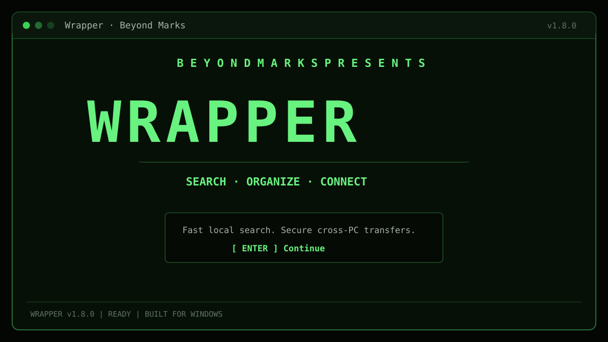
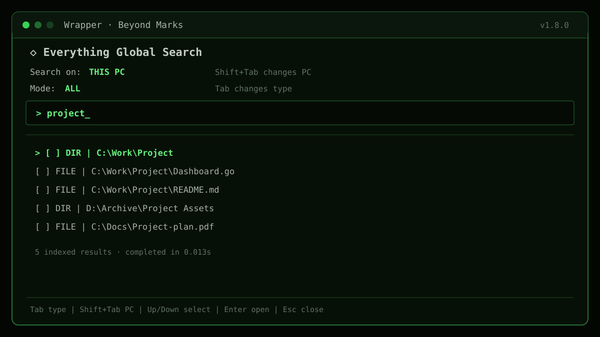
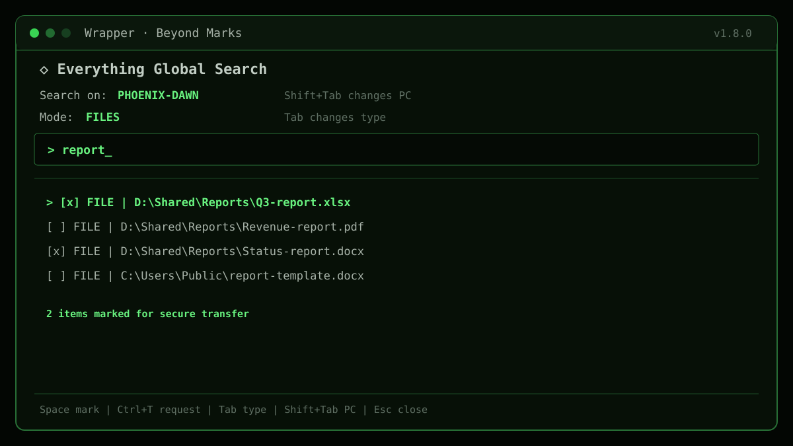
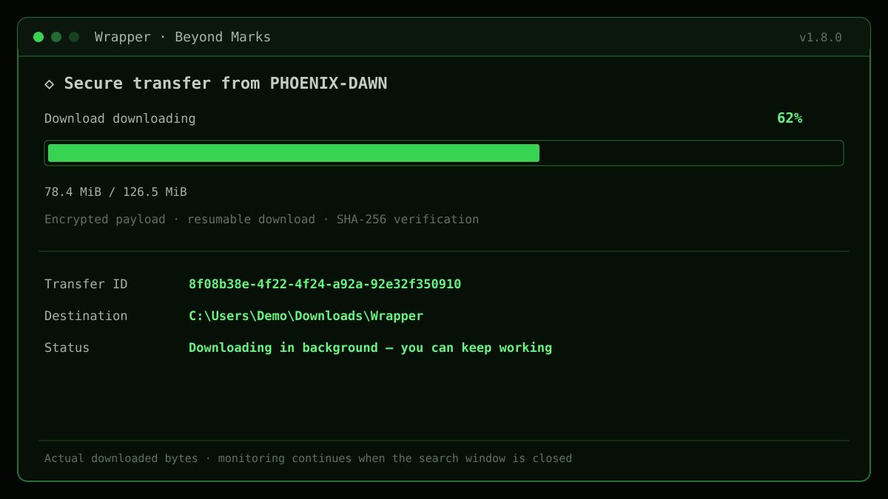
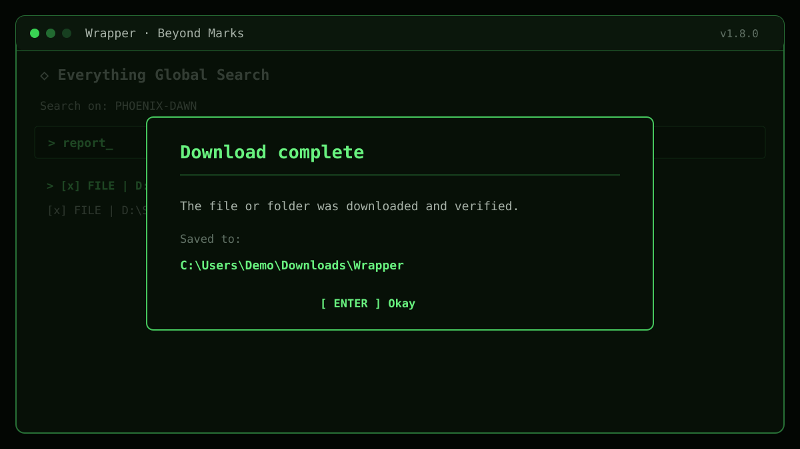

# Wrapper

  

  <h3>Find files instantly. Fetch them securely from another PC.</h3>

  
A keyboard-first Windows file manager by <strong>Beyond Marks</strong>, powered by Everything search and end-to-end encrypted device transfers.

  

    
    
    
  

  
<strong><a href="https://github.com/beyondmarks-ai/Wrapper/releases/latest/download/Wrapper-Setup-x64.exe">Download Wrapper for Windows</a></strong>

---

## Why Wrapper?

| Capability | What it gives you |
|---|---|
| Instant local search | Search the live Everything index in milliseconds and filter by all items, files, or folders. |
| Search another PC | View indexed results from explicitly shared folders on a paired, online Windows PC. |
| Fetch only what you need | Mark one or more remote results and press <kbd>Ctrl</kbd>+<kbd>T</kbd>; Wrapper transfers only those items. |
| Visible progress | See the real stage, percentage, downloaded bytes, and destination while a transfer runs. |
| Private transfers | Files and manifests are encrypted on the source PC before upload and decrypted only on the destination PC. |
| Full file manager | Keyboard navigation, multiple panels, previews, metadata, archives, clipboard operations, themes, and more. |

## Product tour

### 1. Search this PC instantly

Press <kbd>Ctrl</kbd>+<kbd>G</kbd> and type a name. Wrapper queries the live Everything index instead of walking the disk.

### 2. Search a paired PC

Press <kbd>Shift</kbd>+<kbd>Tab</kbd> to switch devices, <kbd>Tab</kbd> to choose ALL, FILES, or FOLDERS, and <kbd>Space</kbd> to mark remote results.

### 3. Follow the real download

After <kbd>Ctrl</kbd>+<kbd>T</kbd>, Wrapper shows the transfer stage, actual downloaded bytes, percentage, and destination. Monitoring continues even if the search window is closed.

### 4. Know exactly where it was saved

After decryption and integrity verification, Wrapper displays a completion popup with the destination folder.

## Install in one step

### Requirements

- Windows 10 or Windows 11, x64.
- Internet access for sign-in, pairing, remote search, and transfers.
- Both PCs must use the same Google account for cloud features.

### Installation

1. Download [Wrapper-Setup-x64.exe](https://github.com/beyondmarks-ai/Wrapper/releases/latest/download/Wrapper-Setup-x64.exe).
2. Run it as administrator on both PCs.
3. The installer adds Wrapper to PATH, installs Everything 1.4 with its indexing service, installs the Everything SDK DLL, and installs Wrapper Agent.
4. Complete the Google sign-in window and register the PC when prompted.
5. Start Wrapper from PowerShell or Windows Terminal:

       wrap

No separate runtime, Everything installation, SDK setup, or background-service setup is required.

## Connect two PCs

Do these steps once after installing Wrapper on both computers.

### 1. Sign in and register each PC

On both PCs:

    wrap auth login
    wrap device register --name $env:COMPUTERNAME
    wrap agent status

The default download destination is:

    %USERPROFILE%\Downloads\Wrapper

### 2. Choose what remote devices may search

On the PC that owns the files:

    wrap share add C:\Users\you\Documents
    wrap share list

Remote search and remote-requested transfers cannot leave these shared roots.

### 3. Pair the devices

On PC A, create a ten-minute code:

    wrap device code

On PC B, enter that code:

    wrap device pair ABCD-EFGH

PC B prints a pairing ID. Approve it on PC A:

    wrap device confirm PAIRING_ID

Verify the connection on either PC:

    wrap device list

## Search and transfer

1. Run **wrap**.
2. Press <kbd>Ctrl</kbd>+<kbd>G</kbd>.
3. Press <kbd>Shift</kbd>+<kbd>Tab</kbd> until the other PC is selected.
4. Type a file or folder name.
5. Press <kbd>Space</kbd> to mark multiple results, or leave the cursor on one result.
6. Press <kbd>Ctrl</kbd>+<kbd>T</kbd>.
7. Dismiss the request confirmation and watch the progress bar.
8. Wrapper decrypts, verifies, and saves the result under **Downloads\Wrapper**, then displays its location.

### Search shortcuts

| Shortcut | Action |
|---|---|
| <kbd>Ctrl</kbd>+<kbd>G</kbd> | Open Everything Global Search |
| <kbd>Tab</kbd> | Change ALL / FILES / FOLDERS |
| <kbd>Shift</kbd>+<kbd>Tab</kbd> | Change This PC / paired PC |
| <kbd>↑</kbd> / <kbd>↓</kbd> | Move through results |
| <kbd>Space</kbd> | Mark or unmark a remote result |
| <kbd>Enter</kbd> | Open a local result or mark a remote result |
| <kbd>Ctrl</kbd>+<kbd>T</kbd> | Request marked remote results or send a local selection |
| <kbd>Esc</kbd> | Close the search window |

## How transfers work

    wrap.exe
       │  per-user named pipe
       ▼
    wrapper-agent.exe
       │
       ├── local Everything IPC ──► instant indexed search
       │
       └── signed HTTPS + Firebase authentication
                              │
                              ▼
                       Cloud Run API
                         │         │
                  Firestore     private GCS
                   metadata      ciphertext
                                      │
                           automatic deletion after 24h

The source PC creates a compressed archive, encrypts it with the destination device's age X25519 public key, and uploads ciphertext through a resumable session. The destination resumes interrupted downloads, decrypts into a staging directory, rejects unsafe archive entries, verifies the manifest and SHA-256 hashes, and then moves the verified files into place. Name conflicts use keep-both instead of silent overwrite.

## Security model

- Remote search is limited to folders explicitly added with **wrap share add**.
- Search requests, search results, paths, manifests, archives, and file contents are end-to-end encrypted between paired devices.
- Device events are signed; local credentials and device identity are protected with Windows DPAPI.
- Cloud Storage receives ciphertext only. Transfer objects are scheduled for deletion after 24 hours, with a bucket lifecycle safety net.
- Transfers are capped at 20 GiB. Beta accounts are limited to 100 transfers and 50 GiB of ciphertext per rolling 24 hours.
- The service can see account/device identifiers, timestamps, transfer state, encrypted sizes, and normal network metadata.

Read the complete threat model in [docs/SECURITY.md](docs/SECURITY.md).

## Useful commands

| Command | Purpose |
|---|---|
| **wrap auth status** | Show the signed-in account |
| **wrap device list** | List registered and paired devices |
| **wrap share list** | List remotely searchable roots |
| **wrap transfer list** | Inspect cloud transfer state |
| **wrap agent status** | Check the background agent |
| **wrap agent stop** | Stop the background agent |
| **wrap agent start** | Start the background agent |
| **wrap device revoke DEVICE_ID** | Revoke a lost or retired PC |

## Troubleshooting

### The paired PC does not appear

Run **wrap device list** on both PCs and confirm Wrapper Agent is running:

    wrap agent status
    wrap agent start

Both computers must be online, paired, signed into the same account, and running the current Wrapper version.

### Remote search times out

On the remote PC:

    wrap agent stop
    wrap agent start

Also confirm Everything is running and that the requested folder is listed by **wrap share list**.

### A folder is missing from remote results

Add its parent or the folder itself on the PC that owns it:

    wrap share add D:\Shared

### Where was my download saved?

The default location is **%USERPROFILE%\Downloads\Wrapper**. Wrapper v1.8.0 also shows the destination during progress and in the completion popup.

## Build from source

Source builds require Go, and local Everything search on Windows requires **Everything64.dll** from the official [Everything SDK](https://www.voidtools.com/support/everything/sdk/).

    git clone https://github.com/beyondmarks-ai/Wrapper.git
    cd Wrapper
    .\scripts\build.ps1 -EverythingDll C:\path\to\Everything64.dll
    .\bin\wrap.exe

Create the all-in-one installer:

    winget install JRSoftware.InnoSetup
    .\scripts\package.ps1 -EverythingDll C:\path\to\Everything64.dll

The build script runs the test suite and produces **bin\wrap.exe** and **bin\wrapper-agent.exe**. The package script checksum-verifies the pinned official Everything MSI before bundling it.

For production cloud deployment, follow [docs/DEPLOYMENT.md](docs/DEPLOYMENT.md). Infrastructure lives in **infra/** and the control API lives in **backend/**.

## Development checks

    go mod tidy
    gofmt -w .
    go test ./...
    go vet ./...
    .\scripts\build.ps1 -SkipTests
    terraform -chdir=infra fmt -check -recursive
    terraform -chdir=infra validate

## Ownership and license

Wrapper is maintained and distributed by **Beyond Marks** under the [MIT License](LICENSE).

Required licenses for upstream and bundled components are retained in [NOTICE.md](NOTICE.md). Those notices satisfy redistribution requirements and do not indicate ownership of the Wrapper product.