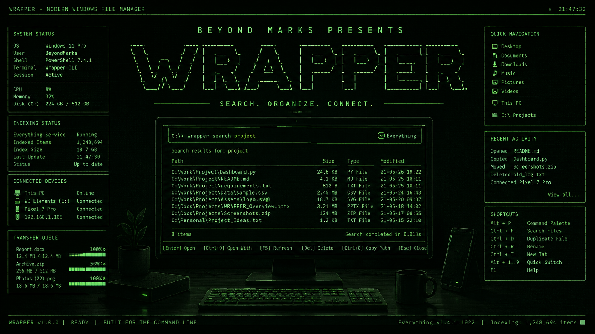

# Wrapper

<div align="center">
  

  <strong>Beyond Marks presents a fast, keyboard-first Windows file manager.</strong>
</div>

Wrapper combines terminal file management, instant Everything search, and end-to-end encrypted transfers between your paired Windows PCs. The cloud coordinates devices and stores temporary ciphertext; it cannot read searched paths, filenames, manifests, or file contents.

## What works

- Instant local search through the live Everything index: all items, files only, or folders only.
- Remote live search across explicitly shared folders on paired, online PCs.
- `Ctrl+T` transfer of the focused item or current multi-selection.
- Resumable 8 MiB uploads and resumed downloads, with SHA-256 verification.
- Encrypted files and folders up to 20 GiB, automatically deleted after 24 hours; beta accounts are limited to 100 transfers and 50 GiB per rolling day.
- Google/Firebase sign-in, short-lived pairing codes, explicit source confirmation, device revocation, and DPAPI-protected local credentials.
- Responsive terminal UI, previews, metadata, archives, clipboard operations, panels, and themes.

## Requirements

- Windows 10 or 11 x64.
- [Everything 1.4](https://www.voidtools.com/downloads/) running with IPC enabled.
- `Everything64.dll` from the official [Everything SDK](https://www.voidtools.com/support/everything/sdk/) beside `wrap.exe`.
- A configured Wrapper Cloud deployment for cross-PC features. Local file management and search do not require cloud access.

## Build

```powershell
git clone https://github.com/beyondmarks-ai/Wrapper.git
cd Wrapper
.\scripts\build.ps1
.\bin\wrap.exe
```

The build script tests the repository and produces both `bin/wrap.exe` and `bin/wrapper-agent.exe`. To make an installer:

```powershell
winget install JRSoftware.InnoSetup
.\scripts\package.ps1 -EverythingDll C:\path\to\Everything64.dll
```

Cloud release values can be supplied through `WRAPPER_CLOUD_API_URL`, `WRAPPER_GOOGLE_CLIENT_ID`, and `WRAPPER_FIREBASE_API_KEY`. They are public desktop application configuration, not service credentials.

## Connect two PCs

Run on each PC:

```powershell
wrap auth login
wrap device register --name $env:COMPUTERNAME
wrap share add C:\Users\you\Documents
```

Registration installs and starts the per-user Wrapper Agent. Then pair:

```powershell
# PC A
wrap device code

# PC B
wrap device pair ABCD-EFGH

# PC A, using the pairing ID printed on PC B
wrap device confirm PAIRING_ID
```

Inside Wrapper:

- `Ctrl+G` opens Everything search.
- `Tab` changes `ALL` / `FILES` / `FOLDERS`.
- `Shift+Tab` changes `This PC` / paired PC.
- `Space` marks remote search results.
- `Ctrl+T` requests marked remote results or sends the focused local selection.

Remote requests can only access configured shared roots. An explicit local `Ctrl+T` send can send the item you selected even when it is outside a shared root.

## Cloud deployment

Production infrastructure is defined in `infra/`, the API is in `backend/`, and the guarded deployment script uses versioned remote Terraform state and keyless GitHub federation. Follow [docs/DEPLOYMENT.md](docs/DEPLOYMENT.md). Security properties and limitations are in [docs/SECURITY.md](docs/SECURITY.md).

## Useful commands

```powershell
wrap auth status
wrap device list
wrap share list
wrap transfer list
wrap agent status
wrap agent stop
wrap agent start
```

## Architecture

```text
wrap.exe  -- per-user named pipe -->  wrapper-agent.exe
   |                                      |
   | local Everything IPC                 | signed HTTPS + Firebase ID token
   v                                      v
Everything index                    Cloud Run control API
                                          |
                         Firestore metadata + private GCS ciphertext
```

The named pipe is restricted to the current Windows SID and SYSTEM. Cloud requests are signed by the device in addition to Firebase authentication. Transfer payloads use age X25519 encryption before upload.

## Development checks

```powershell
go mod tidy
gofmt -w .
go test ./...
.\scripts\build.ps1 -SkipTests
terraform -chdir=infra fmt -check -recursive
terraform -chdir=infra validate
```

## License

Wrapper is licensed under [MIT](LICENSE). Third-party notices are retained in [NOTICE.md](NOTICE.md).
